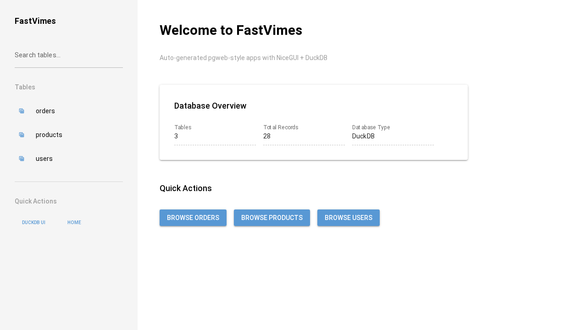

# FastVimes Documentation

Complete documentation for FastVimes - auto-generated database web applications.

## 🚀 Getting Started

### User Guides
- **[UI Quick Start](UI_QUICK_START.md)** - Get up and running in 5 minutes
- **[UI Walkthrough](UI_WALKTHROUGH.md)** - Complete visual guide to the interface
- **[Component Override Guide](component_override_guide.md)** - Customize the auto-generated interface

### Developer Guides  
- **[Testing Guide](TESTING.md)** - Testing strategies and best practices
- **[Playwright Testing](PLAYWRIGHT_TESTING.md)** - UI testing and screenshot capture
- **[RQL Implementation](RQL_IMPLEMENTATION.md)** - Query language details
- **[Performance Testing](test_performance_guide.md)** - Performance optimization

## 📸 Visual Guides

All documentation includes screenshots showing real FastVimes interfaces:



**Available Screenshots:**
- Homepage and navigation
- Data table views with filtering
- Form creation and editing
- API documentation interface
- Mobile responsive design

## 🎯 Quick Links

### For End Users
1. **[Start Here](UI_QUICK_START.md)** - Basic usage guide
2. **[Full Walkthrough](UI_WALKTHROUGH.md)** - Detailed feature tour
3. **Database Navigation** - Tables, forms, and data exploration

### For Developers
1. **[Testing Setup](PLAYWRIGHT_TESTING.md)** - UI testing with Playwright
2. **[Customization](component_override_guide.md)** - Override auto-generated components  
3. **[API Integration](RQL_IMPLEMENTATION.md)** - RQL query language and API usage

### For System Administrators
1. **[Performance](test_performance_guide.md)** - Optimization and monitoring
2. **[Production Setup](../README.md#production-deployment)** - DuckLake and multi-user deployment
3. **Testing Strategy** - Automated testing and validation

## 📚 Documentation Structure

```
docs/
├── README.md                    # This index
├── UI_QUICK_START.md           # 5-minute getting started
├── UI_WALKTHROUGH.md           # Complete visual walkthrough  
├── PLAYWRIGHT_TESTING.md       # UI testing and screenshots
├── component_override_guide.md # Customization guide
├── RQL_IMPLEMENTATION.md       # Query language details
├── TESTING.md                  # Testing strategies
├── test_performance_guide.md   # Performance optimization
└── screenshots/                # All UI screenshots
    ├── 01-homepage.png
    ├── 04-users-table.png
    ├── 06-add-form.png
    └── ...
```

## 🛠️ Contributing to Documentation

### Adding Screenshots
```bash
# Capture new walkthrough screenshots
uv run python scripts/capture_walkthrough_screenshots.py

# Update screenshots in documentation
# Edit UI_WALKTHROUGH.md to reference new images
```

### Testing Documentation
```bash
# Verify all links work
# Check that screenshots load properly  
# Test example code snippets
```

## 🎨 Screenshot Details

**Captured Automatically**: All screenshots are generated using Playwright automation to ensure they stay current with the UI.

**Resolution**: 1280x720 desktop resolution with mobile variants at 375x667
**Format**: PNG with optimized compression
**Total Size**: ~238 KB for complete walkthrough set

**Available Views:**
- Desktop homepage and navigation
- Table data views with interactive features
- Form creation with sample data
- API documentation browser
- Mobile responsive layout

---

**Next Steps**: Start with the [UI Quick Start](UI_QUICK_START.md) guide for immediate hands-on experience with FastVimes.
