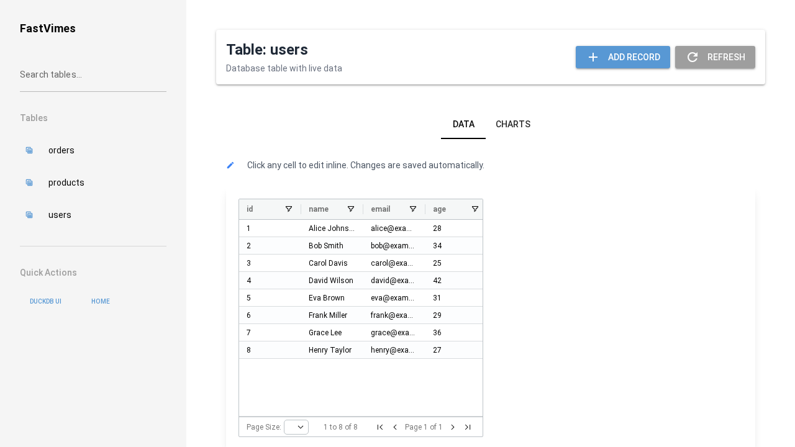
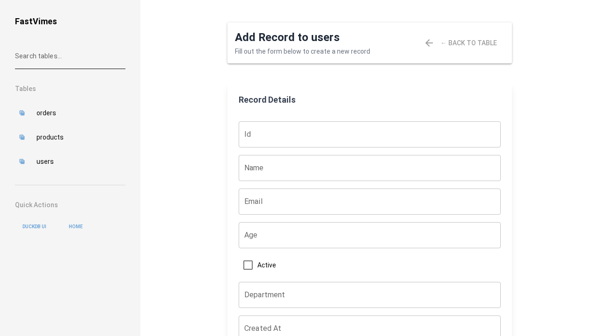
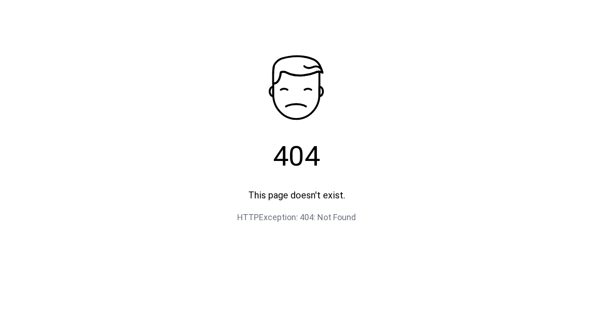
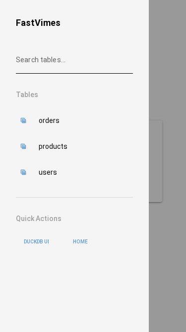

# FastVimes UI Quick Start

Get up and running with FastVimes in 5 minutes.

## 🚀 Start FastVimes

```bash
# Start with sample data
uv run fastvimes serve

# Visit in your browser
open http://localhost:8000
```

## 📊 View Your Data



1. Navigate to any table (e.g., `/table/users`)
2. Browse data with the interactive grid
3. Use search/filter to find specific records

## ➕ Add New Records



1. Click "Add Record" from any table view
2. Fill in the form fields
3. Submit to create new data

## 🔌 Use the API



1. Visit `/api/docs` for interactive API documentation
2. Try endpoints directly in the browser
3. Copy examples for your applications

## 📱 Mobile Ready



FastVimes works perfectly on mobile devices with responsive design.

## 🎯 Key URLs

- **Homepage**: http://localhost:8000
- **Tables**: http://localhost:8000/table/{table_name}
- **Forms**: http://localhost:8000/form/{table_name}  
- **API Docs**: http://localhost:8000/api/docs
- **API Data**: http://localhost:8000/api/v1/data/{table_name}

## 💡 Pro Tips

- **Export Data**: Add `?format=csv` to any table URL
- **Filter Data**: Use RQL like `?eq(name,Alice)` in API calls
- **Mobile Access**: Full functionality available on phones/tablets
- **Real-time**: Changes appear immediately in the interface

**Next**: Read the [full walkthrough](UI_WALKTHROUGH.md) for detailed feature explanations.
