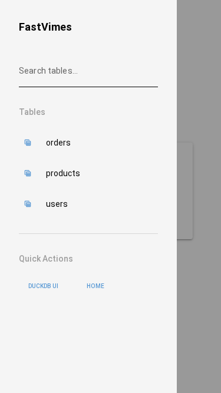

# FastVimes UI Walkthrough

Welcome to FastVimes! This walkthrough will guide you through the key features of the FastVimes user interface using real screenshots from the application.

## Table of Contents
1. [Getting Started](#getting-started)
2. [Homepage Overview](#homepage-overview)
3. [Viewing Data Tables](#viewing-data-tables)
4. [Working with Data](#working-with-data)
5. [Adding New Records](#adding-new-records)
6. [API Documentation](#api-documentation)
7. [Mobile Experience](#mobile-experience)
8. [Next Steps](#next-steps)

---

## Getting Started

FastVimes is an auto-generated web application that creates a pgweb-style interface for exploring and managing database data. It automatically generates tables, forms, and API endpoints from your DuckDB schema.

### Prerequisites
- FastVimes server running (typically on http://localhost:8000)
- Sample data loaded (automatically included)

---

## Homepage Overview

When you first access FastVimes, you'll see the homepage with a clean, modern interface:


**Key Elements:**
- **Application Title**: FastVimes branding and welcome message
- **Navigation**: Quick access to different sections
- **Getting Started**: Links to key functionality
- **Clean Design**: Responsive layout that works on all devices

The homepage serves as your entry point to explore the database contents and functionality.

---

## Viewing Data Tables

FastVimes automatically discovers your database tables and makes them accessible through the web interface.

### Table Navigation


The interface provides easy access to all available tables in your database. You can:
- Browse available tables
- Navigate directly to table views
- See table metadata and structure

### Data Table View


When you access a specific table (like `users`), you get a rich data grid with:

**Key Features:**
- **Data Grid**: Interactive table showing all records
- **Column Headers**: Clear field names and types
- **Pagination**: Navigate through large datasets
- **Responsive Layout**: Adapts to screen size
- **Visual Clarity**: Clean, readable data presentation

### Advanced Table Features


The data grid includes advanced features for data exploration:

**Interactive Elements:**
- **Search/Filter**: Find specific records quickly
- **Sorting**: Click column headers to sort data
- **Column Management**: Show/hide columns as needed
- **Export Options**: Download data in various formats
- **Real-time Updates**: See changes immediately

**Navigation Options:**
- Direct table access via URLs
- Quick search across all data
- Breadcrumb navigation
- Back to table list functionality

---

## Working with Data

FastVimes provides powerful tools for data exploration and analysis:

### Data Exploration
- **Browse**: Scroll through records with smooth pagination
- **Search**: Find specific records using the search functionality
- **Filter**: Apply filters to focus on relevant data
- **Sort**: Order data by any column

### Data Formats
- **JSON**: API responses in JSON format
- **CSV**: Export data for spreadsheet applications
- **Parquet**: High-performance data format for analytics

### Real-time Features
- **Live Updates**: Changes appear immediately
- **Auto-refresh**: Optional automatic data refresh
- **Error Handling**: Graceful handling of data issues

---

## Adding New Records

FastVimes automatically generates forms for adding new records to your tables:

### Empty Form


**Form Features:**
- **Auto-generated Fields**: Based on table schema
- **Type Validation**: Appropriate input types for each field
- **Required Fields**: Clear indication of mandatory data
- **User-friendly Layout**: Clean, organized form design

### Filled Form Example


**Form Interaction:**
- **Easy Data Entry**: Intuitive field types (text, email, numbers)
- **Validation**: Real-time field validation
- **Clear Labels**: Descriptive field names
- **Submit Actions**: Create new records with one click

**Supported Field Types:**
- Text inputs for strings
- Email inputs with validation
- Number inputs for numeric data
- Date pickers for temporal data
- Dropdown selects for constrained values
- Checkboxes for boolean fields

**Form Workflow:**
1. Navigate to the form (via "Add Record" buttons)
2. Fill in the required fields
3. Submit to create the new record
4. Automatic redirect back to table view
5. See your new record in the data grid

---

## API Documentation

FastVimes automatically generates comprehensive API documentation:


**API Features:**
- **OpenAPI/Swagger UI**: Interactive API documentation
- **Auto-generated Endpoints**: REST API for all tables
- **Request/Response Examples**: Clear API usage examples
- **Authentication Support**: When configured
- **Rate Limiting**: Production-ready API controls

**Available Endpoints:**
- `GET /api/v1/meta/tables` - List all tables
- `GET /api/v1/meta/schema/{table}` - Get table schema
- `GET /api/v1/data/{table}` - Get table data with filtering
- `POST /api/v1/data/{table}` - Create new records
- `PUT /api/v1/data/{table}` - Update existing records
- `DELETE /api/v1/data/{table}` - Delete records

**Query Parameters:**
- **RQL Filtering**: `?eq(name,Alice)` for filtering
- **Format Options**: `?format=json|csv|parquet`
- **Pagination**: `?limit=50&offset=100`
- **Sorting**: `?sort(+name,-created_at)`

**Try It Out:**
- Click on any endpoint to expand details
- Use the "Try it out" button to test API calls
- See real request/response examples
- Copy curl commands for external use

---

## Mobile Experience

FastVimes is fully responsive and works great on mobile devices:



**Mobile Features:**
- **Responsive Design**: Adapts to any screen size
- **Touch-friendly**: Optimized for touch interaction
- **Fast Loading**: Lightweight for mobile networks
- **Full Functionality**: All features available on mobile

**Mobile Optimizations:**
- Collapsible navigation for more screen space
- Touch-optimized buttons and controls
- Readable text at any zoom level
- Efficient data loading for slower connections

---

## Key Workflows

### Exploring Your Data
1. **Start** at the homepage
2. **Navigate** to table list or directly to a table
3. **Browse** data using the interactive grid
4. **Search/Filter** to find specific records
5. **Export** data when needed

### Adding New Data
1. **Navigate** to any table view
2. **Click** "Add Record" button
3. **Fill** in the form fields
4. **Submit** to create the record
5. **View** your new data in the table

### Using the API
1. **Visit** the `/api/docs` endpoint
2. **Explore** available endpoints
3. **Try** API calls interactively
4. **Copy** examples for your applications
5. **Integrate** with external tools

### Data Management
1. **View** table schemas in the API docs
2. **Understand** data relationships
3. **Export** data in multiple formats
4. **Import** data via API endpoints
5. **Monitor** data changes in real-time

---

## Advanced Features

### RQL Query Language
FastVimes supports Resource Query Language (RQL) for powerful data filtering:

```
# Basic filtering
GET /api/v1/data/users?eq(department,Engineering)

# Complex queries  
GET /api/v1/data/users?and(eq(active,true),gt(age,25))

# Sorting and pagination
GET /api/v1/data/users?sort(+name)&limit(50)
```

### Multiple Data Formats
- **JSON**: Default format for web applications
- **CSV**: Excel-compatible export format
- **Parquet**: High-performance analytics format

### Schema Introspection
- Automatic table discovery
- Field type detection
- Relationship mapping
- Constraint validation

---

## Next Steps

### For End Users
1. **Explore** your data using the table views
2. **Add** new records using the forms
3. **Export** data for external analysis
4. **Share** table URLs with team members

### For Developers
1. **Study** the API documentation
2. **Integrate** with your applications
3. **Extend** functionality as needed
4. **Contribute** improvements back to FastVimes

### For Administrators
1. **Configure** authentication if needed
2. **Set up** production database connections
3. **Monitor** API usage and performance
4. **Scale** for multiple users with DuckLake

---

## Getting Help

### Documentation
- **API Docs**: Visit `/api/docs` for complete API reference
- **GitHub**: Check the FastVimes repository for detailed documentation
- **Examples**: Look at the `examples/` directory for sample applications

### Common Tasks
- **Data Export**: Use format parameters in API calls or table views
- **Bulk Operations**: Use the API endpoints for large data operations
- **Custom Forms**: Override default forms with custom implementations
- **Advanced Queries**: Use RQL for complex data filtering

### Troubleshooting
- **Connection Issues**: Check that FastVimes server is running
- **Data Problems**: Verify your database schema and data integrity
- **Performance**: Consider pagination for large datasets
- **Mobile Issues**: Ensure responsive design works on your target devices

---

**Congratulations!** 🎉 You now have a comprehensive understanding of the FastVimes user interface. The auto-generated interface provides powerful data exploration capabilities while maintaining simplicity and ease of use.

For more advanced usage, check out the API documentation and consider customizing the interface for your specific needs.
